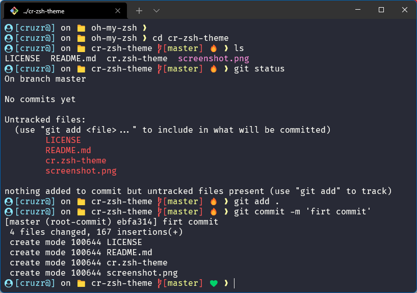

# cr-zsh-theme

An oh-my-zsh theme.

## Introducion

## instalación

1.  En tu terminal escribe lo siguiente:`git clone git@github.com:cruzrovira/cr-zsh-theme.git/ $ZSH_CUSTOM/themes/cr-zsh-theme`
2.  Abre tu configuración de `.zshrc`
3.  agrege una font de [Nerd Font](https://www.nerdfonts.com/) a su terminal
4.  cambia el valor `ZSH_THEME` por _`cr-zsh-theme/cr`_

REF: [Oh-My-Zsh External themes](https://github.com/ohmyzsh/ohmyzsh/wiki/External-themes)

### Extras

agrega los plugins zsh-autosuggestions y zsh-syntax-highlighting

### License

cr-zsh-theme is released under the [MIT License](https://opensource.org/licenses/MIT).
